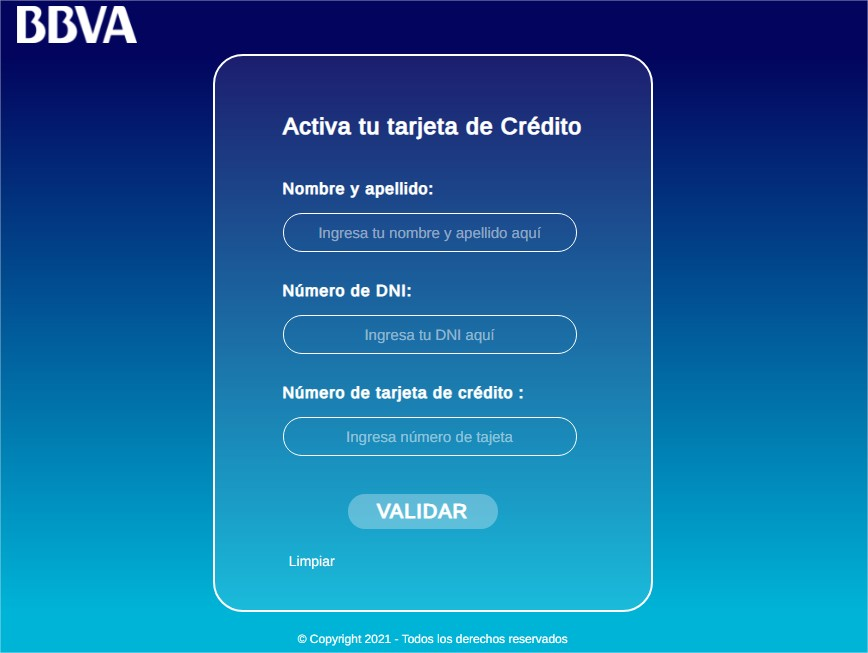

# Card validator 💳

Web to activate credit cards online.

<!--  -->

## Users and objectives

- Users are people who want to use a credit card.
  Los ususarios son personas quiénes desean utilizar una tarjeta de crédito.
- The objective of the product is to activate a credit card virtually.

## Identification of problems and needs

- The product is designed so that people do not go to banks to activate your credit card. The bank takes the card to your home and through airtual validation, you can activate it and make use of your credit card.

### **Pre requirements**

`git`
`node v18.17.0`
`yarn 1.22.19`

### **Installation**

- Clone: `git clone "project_url"`

- Dependency installation command: `yarn`

- Run the development server: `http://localhost:3000`

  `yarn start`

### **Built with:**

`JavaScript, CSS3, HTML5, Sass`

## 🚀 **Deploy**

These instructions will allow you to deploy the project:
This application is deployed on `Vercel` and updates automatically when pushing on `main` branch.

## **Test**

- `Lighthouse`

  Upload test capture here...

## **Author** ✒️

_Maritza Rodriguez - Front-end developer_

2021
